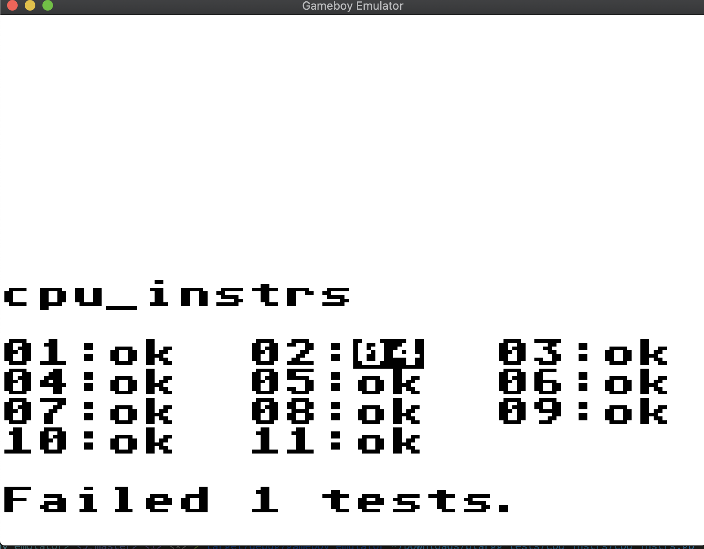

# GameBoy Emulator


[](https://travis-ci.org/benkonz/gameboy_emulator)
[](https://ci.appveyor.com/project/benkonz/gameboy-emulator/branch/master)

This is a GameBoy emulator written in Rust. It can be compiled to native
and web assembly, see the build section for more details.

Emulator supports sound, several hardware types, RTC, gameboy color emulation,
sprites, and saving to browser local storage (web) and user config directories (native)

The web assembly port is currently hosted [here](https://benkonz.github.io/assets/emulator)

## Screenshots

<p align="center">
    
    
</p>
<p align="center">
    
    
</p>
<p align="center">
    
    
</p>
<p align="center">
    
    
</p>
<p align="center">
    
    
</p>

## Installing

The native version is published to [crates.io](https://crates.io/crates/gameboy_opengl) and can be 
installed by running:

```text
cargo install gameboy_opengl
```

Then you can run it by running: `gameboy_emulator` from your terminal

## Building from source

The project uses Cargo as a build system, so building the project is relatively
simple.

### Native

```text
cargo build --package gameboy_opengl --bin gameboy_emulator --release
```

this produces the executable `target/release/gameboy_emulator.exe`

to run it, just supply the rom file as the first file argument

### Web Assembly

`cargo-web` is very useful for building the web
port of the emulator.

```text
cargo-web deploy --release
```

use your favorite static file server to serve the files generated in the
`target/deploy` directory. You can also run `cargo-web start --release`, to serve the files locally.
